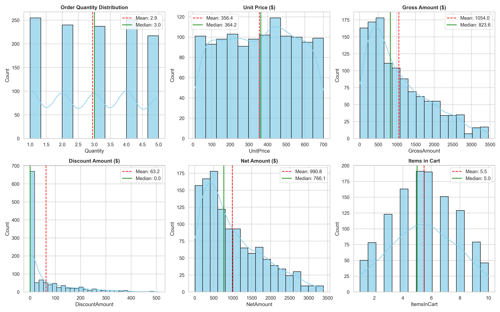
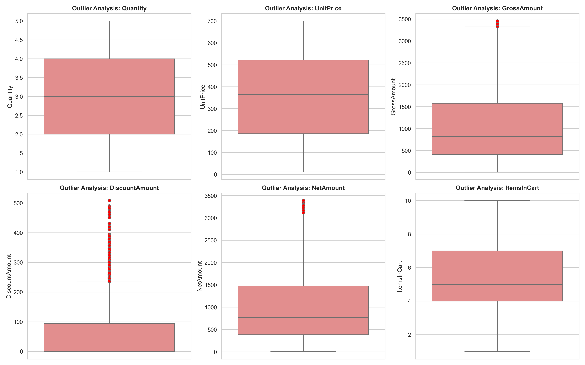
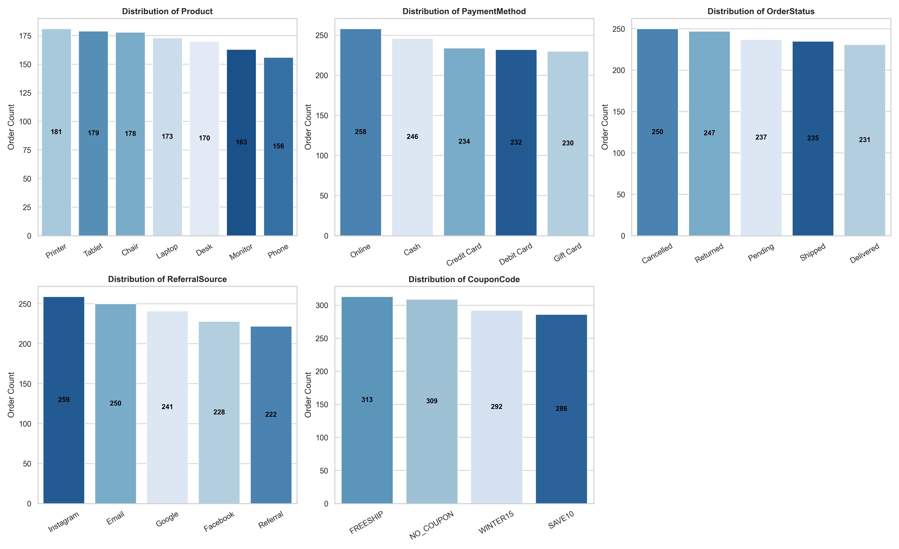
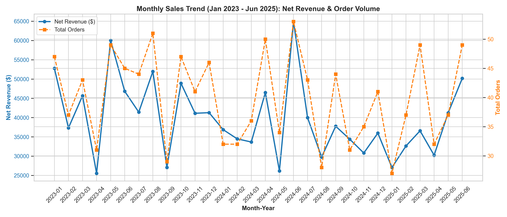
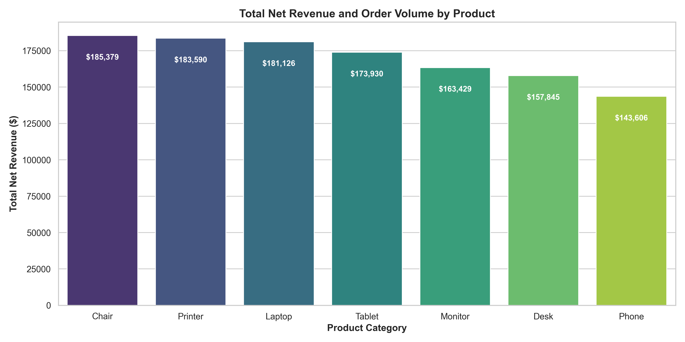
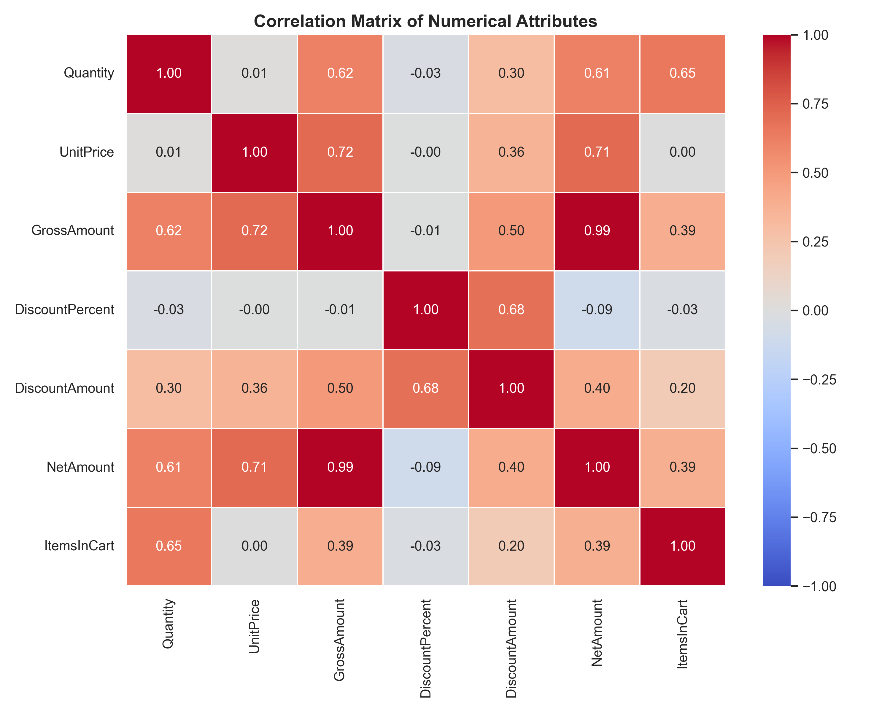

# Project 2: Exploratory Data Analysis (EDA) - Ecommerce Analytics


## 📌 Project Overview
This project presents an end-to-end **Exploratory Data Analysis (EDA)** on an ecommerce dataset comprising **1,200 orders** recorded between **January 2023 and June 2025**. The goal is to discover key statistical distributions, underlying sales trends, acquisition channel performance, and operational anomalies/outliers.

### 🎯 Key Project Requirements Fulfilling
- **Calculate Basic Statistics**: Central tendencies (Mean, Median, Mode) and dispersion metrics (Std Dev, Min, Max, Q1, Q3, IQR, Skewness).
- **Identify Trends and Outliers**: Detection of upper quartile anomalies via IQR and Z-Score methods, along with 30-month trend analysis.
- **Summarize Key Observations**: Actionable takeaways highlighting revenue leakage, top-performing product categories, and marketing channel conversion.

---

## 📁 Repository Structure
```text
├── Cleaned_Dataset_for_Data_Analytics.xlsx  # Cleaned source dataset (1,200 rows x 24 columns)
├── eda_analysis.py                         # Automated Python EDA pipeline script
├── EDA_Analysis.ipynb                      # Interactive Jupyter Notebook with step-by-step code & markdown
├── EDA_Summary_Report.md                   # Comprehensive Markdown analysis report
├── README.md                               # Project documentation & GitHub overview
└── visualizations/                         # Visual charts and exported CSV statistical summaries
    ├── 01_numerical_distributions.png
    ├── 02_outlier_boxplots.png
    ├── 03_categorical_distributions.png
    ├── 04_monthly_trends.png
    ├── 05_product_revenue.png
    ├── 06_correlation_heatmap.png
    ├── basic_statistics.csv
    └── outliers_summary.csv
```

---

## 📊 Summary Statistics & Key Findings

### 1. Basic Descriptive Statistics
| Metric | Count | Mean | Median | Mode | Std Dev | Min | Q1 (25%) | Q3 (75%) | IQR | Max | Skewness |
| :--- | :--- | :--- | :--- | :--- | :--- | :--- | :--- | :--- | :--- | :--- | :--- |
| **Quantity** | 1200 | 2.95 | 3.00 | 2.00 | 1.41 | 1.00 | 2.00 | 4.00 | 2.00 | 5.00 | 0.01 |
| **UnitPrice** | 1200 | $356.41 | $364.21 | $423.82 | $195.91 | $11.39 | $186.06 | $521.57 | $335.51 | $699.93 | -0.10 |
| **GrossAmount** | 1200 | $1053.97 | $823.62 | $78.29 | $792.83 | $11.39 | $410.52 | $1578.48 | $1167.96 | $3456.40 | 0.89 |
| **DiscountPercent** | 1200 | 0.06 | 0.00 | 0.00 | 0.06 | 0.00 | 0.00 | 0.10 | 0.10 | 0.15 | 0.44 |
| **DiscountAmount** | 1200 | $63.21 | $0.00 | $0.00 | $83.05 | $0.00 | $0.00 | $93.81 | $93.81 | $508.62 | 1.62 |
| **NetAmount** | 1200 | $990.75 | $766.11 | $78.29 | $756.24 | $9.68 | $384.92 | $1478.53 | $1093.61 | $3390.95 | 0.89 |
| **ItemsInCart** | 1200 | 5.49 | 5.00 | 4.00 | 2.29 | 1.00 | 4.00 | 7.00 | 3.00 | 10.00 | 0.03 |

---

### 2. Outlier Identification (IQR & Z-Score)
- **Gross & Net Amount Outliers**: 8 transactions exceeded the upper IQR threshold of $3,330.41, reaching up to $3,456.40. These reflect valid bulk orders (e.g. 5 units of high-priced items).
- **Z-Score Verification**: **0 observations** exceeded $|Z| > 3$, verifying that extreme order values represent genuine operational orders rather than errors.

| Metric | IQR Lower Bound | IQR Upper Bound | IQR Outliers Count | IQR Outlier % | Z-Score (>3) Count |
| :--- | :--- | :--- | :--- | :--- | :--- |
| **Quantity** | -1.00 | 7.00 | 0 | 0.0% | 0 |
| **UnitPrice** | -317.20 | 1024.83 | 0 | 0.0% | 0 |
| **GrossAmount** | -1341.41 | 3330.41 | 8 | 0.67% | 0 |
| **DiscountAmount** | -140.72 | 234.53 | 100 | 8.33% | 0 |
| **NetAmount** | -1255.49 | 3118.94 | 13 | 1.08% | 0 |
| **ItemsInCart** | -0.50 | 11.50 | 0 | 0.0% | 0 |

---

## 📈 Visualizations Gallery

| Chart Title | Visual Preview |
| :--- | :--- |
| **1. Numerical Feature Distributions** |  |
| **2. Outlier Analysis (Boxplots)** |  |
| **3. Categorical Distributions** |  |
| **4. Monthly Sales & Revenue Trends** |  |
| **5. Product Revenue Breakdown** |  |
| **6. Correlation Heatmap** |  |

---

## 💡 Key Strategic Observations

1. **⚠️ High Revenue Leakage Alert**:
   - **41.41% of total orders** are either Cancelled (20.83%) or Returned (20.58%).
   - Total lost revenue from cancellations/returns equals **$488,212.34**.
2. **🏆 Top Revenue Product Categories**:
   - **Laptop** ($181,126 net revenue) and **Chair** ($185,379 net revenue) lead revenue generation.
   - **Printer** (181 orders) and **Tablet** (179 orders) represent the highest order volume.
3. **📣 Acquisition Channel Performance**:
   - **Instagram** (259 orders) and **Email** (250 orders) drive the highest customer conversion.

---

## 🚀 How to Run the Analysis Locally

### 1. Prerequisites
Ensure Python 3.8+ is installed along with the required libraries:
```bash
pip install pandas numpy matplotlib seaborn openpyxl scipy
```

### 2. Run Analysis Pipeline
Execute the automated analysis script:
```bash
python eda_analysis.py
```

### 3. Open Jupyter Notebook
Launch Jupyter Notebook to view interactive code cells:
```bash
jupyter notebook EDA_Analysis.ipynb
```

---
*Created as part of Decode Labs Internship - Project 2.*
